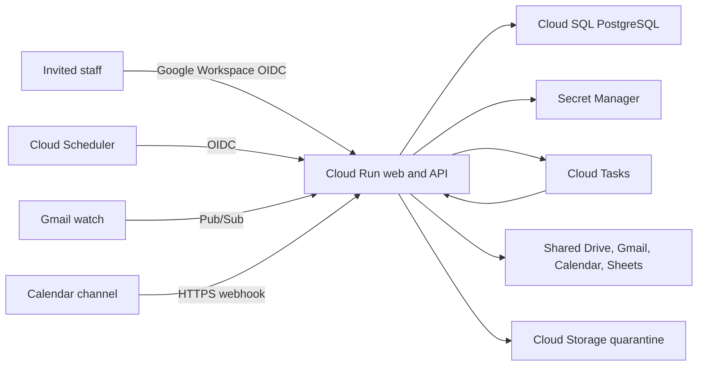

# FCI Operations: 20-user product and architecture review

Reviewed: July 12, 2026  
Audience: Business owner, Google Workspace administrator, product owner, and developers

## Executive decision

The current application is a credible single-user hosted development environment. It is not ready for a 20-person company rollout or real client data.

The strongest parts are the clear client-to-project structure, review-first Gmail workflow, Shared Drive and Sheets plan, records-based assistant citations, and honest placeholders for unfinished scheduling and task features. The rollout blockers are foundational rather than cosmetic:

1. Every authenticated user in the hosted development environment still has company-wide data access. The approved source policy now defines granular Administrator, Office, and Project Manager ceilings, exact-one-role/session denial rules, and project-scoped PostgreSQL queries. A narrow Cloud Run source boundary composes dashboard, search, project, client, logout, Workspace OIDC, invitation-redemption, and session-issuance routes, while file/Gmail/Calendar routes are authorization-gated but provider-unavailable. None of it is deployed or connected to the hosted interface; OIDC hardening, live configuration, migration/apply, production session/UI composition, and employee admission remain open. The hosted interface still shows only its development `Admin` or `Office` label.
2. Source now contains the approved fail-closed Cloud Run boundary and PostgreSQL foundation, but the full application, Google Cloud infrastructure, background-job operations, backup, and recovery platform are not yet implemented or provisioned.
3. The owner-approved application policy now has a local testable model, but Google Groups, direct Workspace access, account lifecycle, and live provider enforcement do not yet form one tested cross-system access model.
4. The data model and synchronous Google operations are not safe for concurrent staff activity or transient Google outages.
5. Several controls look operational even though they only save configuration or show a success message.

Keep the hosted site limited to one authorized tester and clearly marked test records while these gates are completed.

## Evidence reviewed

- The current hosted development environment was exercised across Overview, Leads, Clients, project details, Schedule, Inbox, AI Assistant, Reports, and Settings.
- No browser console errors appeared during the tested desktop workflows.
- The application, API routes, database schema, Google connector code, tests, deployment configuration, and all repository documentation were reviewed.
- Desktop interactions were checked at 1280 × 720. Screenshot capture timed out and the in-app browser did not apply the requested mobile viewport, so mobile visual acceptance remains unverified. Responsive CSS and mobile rendering branches were reviewed statically, but that is not a substitute for device testing.

## Target operating model for about 20 employees

Use explicit invitations even for people in the company Google Workspace domain, `cherryhillfci.com`. Maintain at least two trained Administrators so access and the Google connection do not depend on one person.

| User type | Recommended application access | Recommended Google access |
| --- | --- | --- |
| Administrator | Company-wide operational and financial records; project creation/assignment; Gmail filing, Calendar creation, file sharing, export, and audit viewing | Only the Workspace resources separately approved for administration; no routine use of a personal super-admin account |
| Office Operations | Company-wide nonfinancial records; create/update leads, clients, and contacts; update existing project status, tasks, meetings, and notes; view/upload nonfinancial files; no project creation/assignment, sensitive Google action, export, audit, or access administration | Direct Gmail, Calendar, Drive, Sheet, and mailbox delegation remain undecided and denied by the application policy |
| Project Manager | Assigned nonfinancial projects and minimum related read-only client/contact context; update assigned status, tasks, meetings, and notes; view/upload assigned-project nonfinancial files | Direct project-folder and calendar access remains undecided; no company inbox or company-wide directory by default |
| Field/Crew Lead | No employee account; a future read-only exact-project link defaults to seven days, is capped at fourteen days, and is immediately revocable | No intake mailbox, company directory, or Shared Drive membership by default |
| Subcontractor or temporary field worker | No application account or access for the first rollout; any future purpose-specific link requires a separate decision | No Shared Drive membership by default |

The owner selected `admincrm@cherryhillfci.com` and `brett@cherryhillfci.com` as the two initial application Administrators and confirmed AdminCRM is individual/not shared. Its managed Workspace status and immutable Google issuer/`sub` still require live verification; Brett's individual managed identity and immutable binding also remain unverified. Every employee requires a single-use seven-day invitation for one exact email/role, has exactly one supported role, and receives no per-user capability overrides. Employee sessions default to 30 minutes idle/eight hours absolute. Sales/Estimator is excluded, Field Leads use the bounded links above rather than accounts, and subcontractors receive no accounts or employee role; any future subcontractor link remains unapproved. See [Authorization simulation](authorization-simulation.md) and [20-user operating model and Google access](task-checklists/06-20-user-operating-model-and-access.md). These decisions do not establish the rollout order or approve direct Google resource access.

## Recommended production architecture

For this company size, prefer one regional modular-monolith application and one database over a collection of microservices.

The target production service set is phased. The minimum launch core is Cloud Run, the selected Cloud SQL profile, Secret Manager integration, Workspace OIDC, and required IAM/networking/monitoring/backup controls. The remaining bullets are activated only with their associated features:

- One Cloud Run service for the web application, API, and authenticated task/webhook handlers.
- One Cloud SQL PostgreSQL database with foreign keys, constraints, transactions, audit fields, connection pooling, and point-in-time recovery.
- Secret Manager for OAuth credentials, token-encryption keys, session secrets, and service credentials.
- Feature-gated Cloud Tasks for approved background jobs, bounded retries, and rate-controlled Google operations. Persist terminal failures and replay controls in application-owned PostgreSQL records rather than treating Cloud Tasks as a durable dead-letter store.
- Feature-gated Cloud Scheduler for approved time-based dispatch, watch/channel renewal, reconciliation, and reminder materialization.
- Feature-gated Pub/Sub only where an approved upstream integration requires it, beginning with Gmail push notifications. Google Calendar uses expiring HTTPS notification channels rather than Pub/Sub.
- Feature-gated Cloud Storage quarantine before any approved untrusted-upload workflow copies files to Shared Drive.
- `pgvector` only when permission-filtered document indexing is actually scheduled; it is not required for launch.

This keeps operating cost and failure modes understandable for a 20-person company while preserving a path to later scale. Development remains on Sites, staging is created on demand, and standalone versus regional-HA Cloud SQL remains an owner choice after cost and recovery review. See the [Production platform decision](architecture-decision-production-platform.md), [Workspace-first, cost-controlled rollout](architecture-decision-workspace-first-cost-controlled-rollout.md), and [Production foundation and migration](task-checklists/07-production-foundation-and-migration.md).

## Findings by priority

### P0 — complete before a second user

1. **Complete and prove server-enforced identity and authorization.** Source now resolves the approved policy, active/revoked/expired/version-invalid sessions, same-role capabilities, project-scoped PostgreSQL reads, and Workspace OIDC with durable invitation redemption/session issuance. The Cloud Run entry point source-composes dashboard, search, project list/exact-project, client list, secure transport, login, and logout; file/Gmail/Calendar routes fail closed as provider-unavailable after authorization. The hosted interface and assistant remain outside that boundary. OIDC hardening/test backfill, live configuration, provider adapters, rendered production permission tests, migration/apply, and deployment remain open.
2. **Resolved in source; verify after deployment: remove the Gmail label-only filing bypass.** The Settings button and standalone API route that could apply `FCI/Filed` without an exact project copy have been removed. Any future repair tool must require an existing archive/project, a reason, and an audit event.
3. **Complete the accepted production platform.** The current application is still coupled to Workers, D1, and R2. Source now includes a fail-closed Cloud Run foundation, the production persistence boundary, immutable migrations, exact least-privilege readiness, a bounded core rehearsal, and zero-resource-by-default Google Cloud definitions, but it is not the full application and no Google Cloud resources, staging migration/restore exercise, or production cutover exists yet.

### P1 — complete before real client data

1. Reconcile application roles with Google Groups, Shared Drive folders, mailbox delegation, calendars, and the directory Sheet. A hidden application control does not revoke direct Google access.
2. Replace free-text relationships and statuses with foreign keys, constraints, version fields, and normalized child records.
3. Add optimistic concurrency and background jobs. Current write and full-Sheet-sync patterns can lose updates or race when several employees work at once.
4. Add timeouts, retry policies, idempotency, application-owned durable failed-job/dead-letter handling, connector health, and token-refresh single-flight behavior around Google calls.
5. Complete and prove backup/restore; apply and deploy the merged separately privileged audit viewer; add retention/export; configure and deploy the source login/session-issuance boundary; add session renewal; deliver production key material and run a rotation drill; and prove connector-account continuity. The source OIDC callback issues durable sessions and the resolver/logout route denies or revokes invalid sessions, but none is configured or deployed as a live login surface. Before accepting untrusted direct uploads or Gmail attachments, also implement file metadata/classification, quarantine, scanning, release, and authorized download controls.
6. Make saved Workspace resource IDs authoritative. Calendar configuration currently has both saved settings and environment values.
7. **Resolved in source; verify after deployment:** Settings loading retains known data and presents typed failures instead of silently replacing failed requests with valid-looking defaults.
8. **Resolved in source; verify after deployment:** unfinished features have visible Working, In development, Setup required, or Planned states, and non-persisting actions are disabled or relabeled.

### P2 — complete during development acceptance

1. Replace the single in-memory page switcher with real routes so refresh, Back, bookmarks, and support links work.
2. Add automatic refetch/invalidation, stale-data timestamps, and conflict handling for multi-user work.
3. **Foundation complete in source; keep in rendered acceptance:** accessible dialog/drawer focus behavior and global-search keyboard navigation are implemented; verify them at supported viewports and with assistive technology.
4. **Resolved in source; keep in rendered acceptance:** typed success, warning, and error feedback with persistent inline retry paths replaces success-only notification behavior.
5. Split the large client component into route and feature modules; validate server payloads with shared schemas.
6. Raise very small metadata text, test 200% zoom, and run real mobile viewport and device checks.
7. Add rendered route, permission, Playwright, and accessibility tests. Lint is already included in continuous integration; broader behavioral coverage remains open.
8. Add rate limits, security headers, correlation IDs, and restrictions around generic record endpoints.

## Corrected delivery order

The owner-approved application role and sensitive-action policy now permits local authorization work. Setup inputs, rollout order, Google Groups, direct Workspace access, and the remaining cross-system lifecycle decisions continue in parallel and gate live identity, provisioning, and Google access.

1. **Infrastructure definitions — complete in source, unapplied:** Sites development is preserved; on-demand staging, alternative Cloud SQL profiles, the minimum core, and disabled optional modules are reviewable. Owner inputs, approved calculator evidence, and any apply remain open.
2. **Production persistence boundary — complete in source, unapplied:** PostgreSQL migration/repository structures now cover generic identity/security audit and production-owned integration/file metadata, with an opaque provider-neutral object-storage contract. See [Production persistence boundary](production-persistence-boundary.md).
3. **Authorization policy — implemented in source, not deployed:** the approved granular role ceilings, one-role/no-override rules, invitation/session/Field-link defaults, project scoping, secure-session denial behavior, fixed-operation callback gates, and audit evidence run against accepted production boundaries. See [Authorization simulation](authorization-simulation.md).
4. **Narrow Cloud Run employee routes — implemented in source, not deployed:** PostgreSQL-backed dashboard, search, project list/exact-project, client list, Workspace OIDC/session issuance, and logout are composed. File/Gmail/Calendar paths are authorization-gated but provider-unavailable; the interface, remaining routes, live identity configuration/admission, and providers remain open.
5. **Staging and recovery proof:** with separate approval, create staging on demand and prove migration, restore, reconciliation, rollback/forward-fix, and the complete application smoke path.
6. **Live employee identity:** the Workspace OIDC/invitation/session source exists; complete its hardening/tests, then configure and verify it only after the platform, persistence, authorization, and staging gates pass.
7. **Administration and Activity source milestone merged:** the simplified [Administration and Access plan](administration-and-access-plan.md) now has the bounded People projection/page, one people/invitation list, read-only role presets, five Administrator workflows, final-Administrator/session-invalidation safeguards, and minimized Activity reader/tab. Only the presentation adapter is deployed to private Sites development; production migrations/grants and employee-session/CSRF composition remain unapplied or undeployed. Add Field Links only with the field-assignment model; continue with safe editing/archive, atomic lead conversion, project dates, tasks/follow-ups, file metadata, notes, activity, and concurrent-write protection.
8. **Google operations:** authoritative resource settings, durable Gmail review queue, asynchronous filing, Calendar reconciliation, connector recovery, and exact-project integrity.
9. **Scheduling and field operations:** workers, crews, shifts, conflicts, publish/acknowledge, and the approved field-access model.
10. **Messaging, closeout, reports, and intelligence:** add only after consent, permissions, audit, and job controls are proven.

## Product ideas to evaluate later

- A daily role-aware home view: Office sees inbox exceptions and appointments; Project Managers see assigned project risks; field users see today’s assignments only.
- A project health card driven by real dates, open tasks, unfiled messages, missing documents, and schedule conflicts—not a manually chosen color.
- A guided intake-to-project conversion wizard that deduplicates client/contact records and commits the conversion atomically.
- A Google Workspace health center showing watch/channel expiry, queue depth, last successful sync, credential rotation date, and recovery instructions.
- Expiring field links for shift acknowledgement, issue photos, and completion notes without granting broad application or Shared Drive access.
- A readiness legend beside unfinished areas so testers know whether a feature is working, a safe simulation, awaiting setup, or only planned.

## Go/no-go gates

| Gate | Current result |
| --- | --- |
| Continue one-user test-data development | Go, with current safeguards and test-data cleanup |
| Add a second employee | No-go until P0 identity, permissions, and Gmail integrity work passes |
| Store real client or employee data | No-go until production platform, restore, audit, and retention controls pass, plus quarantine/scanning when untrusted uploads or Gmail attachments are accepted |
| Build scheduling or outbound messaging | No-go until platform, permissions, and background-job controls are accepted |

Owner setup and acceptance work is tracked in the [Task Checklists](task-checklists/README.md). Active backend, Workspace, and Settings implementation status is tracked in the [agent execution plan](agent-plan-architecture-workspace-and-setup.md), with UI remediation tracked in the [design-critique ledger](design-critique-fix-plan.md).
