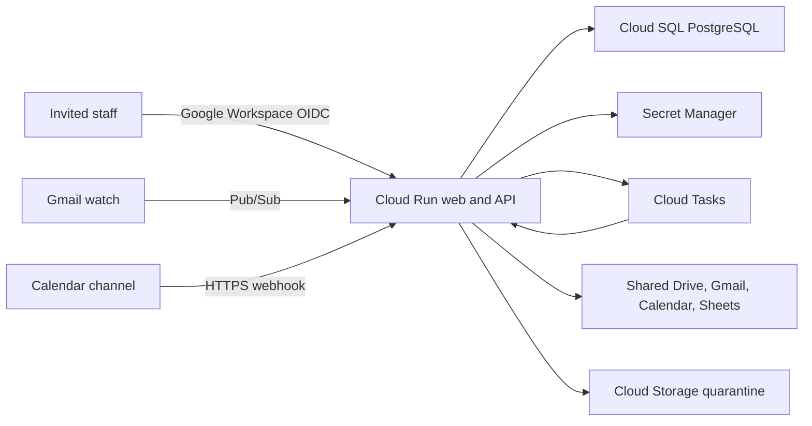

# FCI Operations: 20-user product and architecture review

Reviewed: July 12, 2026  
Audience: Business owner, Google Workspace administrator, product owner, and developers

## Executive decision

The current application is a credible single-user hosted development environment. It is not ready for a 20-person company rollout or real client data.

The strongest parts are the clear client-to-project structure, review-first Gmail workflow, Shared Drive and Sheets plan, records-based assistant citations, and honest placeholders for unfinished scheduling and task features. The rollout blockers are foundational rather than cosmetic:

1. Every authenticated user in the development environment still has company-wide data access. The interface now shows the current server-derived access level (`Admin` or `Office`), but durable roles, capabilities, and project assignments are not implemented.
2. The production Google Cloud, PostgreSQL, background-job, backup, and recovery platform exists only as a documented decision.
3. Application roles and Google Workspace permissions do not yet form one tested access model.
4. The data model and synchronous Google operations are not safe for concurrent staff activity or transient Google outages.
5. Several controls look operational even though they only save configuration or show a success message.

Keep the hosted site limited to one authorized tester and clearly marked test records while these gates are completed.

## Evidence reviewed

- The current hosted development environment was exercised across Overview, Leads, Clients, project details, Schedule, Inbox, AI Assistant, Reports, and Settings.
- No browser console errors appeared during the tested desktop workflows.
- The application, API routes, database schema, Google connector code, tests, deployment configuration, and all repository documentation were reviewed.
- Desktop interactions were checked at 1280 × 720. Screenshot capture timed out and the in-app browser did not apply the requested mobile viewport, so mobile visual acceptance remains unverified. Responsive CSS and mobile rendering branches were reviewed statically, but that is not a substitute for device testing.

## Target operating model for about 20 employees

Use explicit invitations even for people in the company Google Workspace domain, `cherryhillfci.com`. Maintain at least two trained Administrators so access and the Google connection do not depend on one person.

| User type | Recommended application access | Recommended Google access |
| --- | --- | --- |
| Administrator | Company-wide records, user/role administration, connector administration, audit and recovery tools | Workspace resources required for administration; no routine use of a personal super-admin account |
| Office Operations | Company-wide operational records and approved Gmail, Calendar, Drive, and Sheet actions | Intake mailbox delegation, operational calendars, Shared Drive, and directory Sheet as approved |
| Project Manager | Assigned projects plus the minimum client/contact context needed for those projects | Assigned project folders and relevant calendars; no company inbox or company-wide directory by default |
| Field/Crew Lead | Decide whether this is an internal application role; if so, limit it to assigned schedule and field records | No intake mailbox or company directory; limited project-folder access only when required |
| Subcontractor or temporary field worker | No full application account by default; use expiring, purpose-specific links after that feature is built | No Shared Drive membership by default |

The owner must decide whether sales/estimating is part of Office Operations, a separate role, or out of the first rollout. The owner must also decide whether field leads receive full accounts or only expiring assignment links. Record those decisions in [20-user operating model and Google access](task-checklists/06-20-user-operating-model-and-access.md).

## Recommended production architecture

For this company size, prefer one regional modular-monolith application and one database over a collection of microservices.

The initial production service set should be:

- One Cloud Run service for the web application, API, and authenticated task/webhook handlers.
- One Cloud SQL PostgreSQL database with foreign keys, constraints, transactions, audit fields, connection pooling, and point-in-time recovery.
- Secret Manager for OAuth credentials, token-encryption keys, session secrets, and service credentials.
- Cloud Tasks for explicit background jobs, retries, and rate-controlled Google operations.
- Pub/Sub only where the upstream integration requires it, beginning with Gmail push notifications. Google Calendar uses expiring HTTPS notification channels rather than Pub/Sub.
- Cloud Storage as an upload quarantine boundary before approved files are copied to Shared Drive.
- `pgvector` only when permission-filtered document indexing is actually scheduled; it is not required for launch.

This keeps operating cost and failure modes understandable for a 20-person company while preserving a path to later scale. See [Production platform decision](architecture-decision-production-platform.md) and [Production foundation and migration](task-checklists/07-production-foundation-and-migration.md).

## Findings by priority

### P0 — complete before a second user

1. **Implement server-enforced identity and authorization.** Add invited users, sessions, roles, disabled status, granular capabilities, project memberships, and query-scoped authorization. The current dashboard, search, project, and assistant routes expose company-wide data to any authenticated user.
2. **Resolved in source; verify after deployment: remove the Gmail label-only filing bypass.** The Settings button and standalone API route that could apply `FCI/Filed` without an exact project copy have been removed. Any future repair tool must require an existing archive/project, a reason, and an audit event.
3. **Build the accepted production platform.** The current application is coupled to Workers, D1, and R2 and has no Cloud Run container, PostgreSQL migration, infrastructure definition, or production migration runner.

### P1 — complete before real client data

1. Reconcile application roles with Google Groups, Shared Drive folders, mailbox delegation, calendars, and the directory Sheet. A hidden application control does not revoke direct Google access.
2. Replace free-text relationships and statuses with foreign keys, constraints, version fields, and normalized child records.
3. Add optimistic concurrency and background jobs. Current write and full-Sheet-sync patterns can lose updates or race when several employees work at once.
4. Add timeouts, retry policies, idempotency, dead-letter handling, connector health, and token-refresh single-flight behavior around Google calls.
5. Implement backup/restore, audit viewing, file scanning/quarantine, retention, session revocation, key rotation, and connector-account continuity.
6. Make saved Workspace resource IDs authoritative. Calendar configuration currently has both saved settings and environment values.
7. Separate Settings loading and errors. A failed request must not silently look like a valid default value.
8. Give every feature a visible readiness state: Working, In development, Setup required, or Planned. Disable or relabel actions that do not persist or send anything.

### P2 — complete during development acceptance

1. Replace the single in-memory page switcher with real routes so refresh, Back, bookmarks, and support links work.
2. Add automatic refetch/invalidation, stale-data timestamps, and conflict handling for multi-user work.
3. Use accessible dialog and drawer primitives with focus trapping, Escape, focus restoration, and complete keyboard search navigation.
4. Replace success-only toasts with typed success, warning, and error feedback plus an inline retry path.
5. Split the large client component into route and feature modules; validate server payloads with shared schemas.
6. Raise very small metadata text, test 200% zoom, and run real mobile viewport and device checks.
7. Add rendered route, permission, Playwright, and accessibility tests; include lint in continuous integration.
8. Add rate limits, security headers, correlation IDs, and restrictions around generic record endpoints.

## Corrected delivery order

1. **Owner decisions and access design:** finish setup inputs, staff/field policy, Google Groups, and the cross-system access matrix.
2. **Production foundation:** establish development, staging, and production; PostgreSQL; secrets; jobs; storage quarantine; observability; migration and rollback.
3. **Identity and authorization:** Google Workspace OIDC, explicit invitations, sessions, roles, capabilities, project memberships, and negative permission tests.
4. **Core records:** safe editing/archive, atomic lead conversion, project dates, tasks/follow-ups, file metadata, notes, activity, and concurrent-write protection.
5. **Google operations:** authoritative resource settings, durable Gmail review queue, asynchronous filing, Calendar reconciliation, connector recovery, and exact-project integrity.
6. **Scheduling and field operations:** workers, crews, shifts, conflicts, publish/acknowledge, and the approved field-access model.
7. **Messaging, closeout, reports, and intelligence:** add only after consent, permissions, audit, and job controls are proven.

## Product ideas to evaluate later

- A daily role-aware home view: Office sees inbox exceptions and appointments; Project Managers see assigned project risks; field users see today’s assignments only.
- A project health card driven by real dates, open tasks, unfiled messages, missing documents, and schedule conflicts—not a manually chosen color.
- A guided intake-to-project conversion wizard that deduplicates client/contact records and commits the conversion atomically.
- A Google Workspace health center showing watch/channel expiry, queue depth, last successful sync, credential rotation date, and recovery instructions.
- Expiring field links for shift acknowledgement, issue photos, and completion notes without granting broad application or Shared Drive access.
- A readiness legend beside unfinished areas so testers know whether a feature is working, a safe simulation, awaiting setup, or only planned.

## Go/no-go gates

| Gate | Current result |
| --- | --- |
| Continue one-user test-data development | Go, with current safeguards and test-data cleanup |
| Add a second employee | No-go until P0 identity, permissions, and Gmail integrity work passes |
| Store real client or employee data | No-go until production platform, restore, audit, scanning, and retention controls pass |
| Build scheduling or outbound messaging | No-go until platform, permissions, and background-job controls are accepted |

The executable owner and developer work is tracked in the [Task Checklists](task-checklists/README.md).
