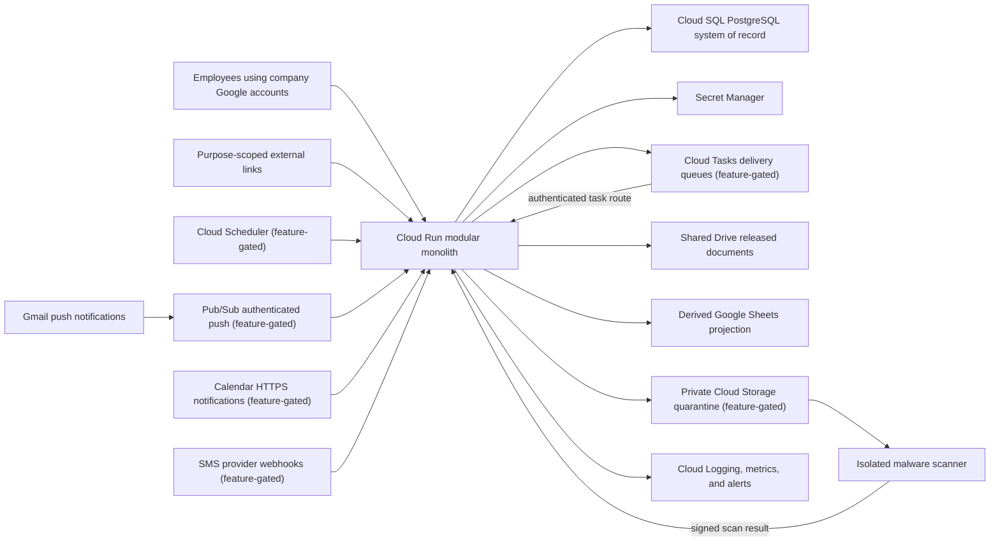

# Complete product and Google Cloud architecture audit

Audit date: July 15, 2026

Scope: FCI Operations for one company and approximately 20 employees

Production target: Google Cloud with Google Workspace-centered identity and collaboration

Status: Architecture baseline and ordered roadmap; runtime, infrastructure-definition, persistence, authorization-simulation, and narrow employee-route boundaries exist in source, while durable admission, recovery proof, live providers, deployment, and broader product decisions remain open

## Executive verdict

The accepted Google Cloud runtime direction is appropriate. Keep one regional Cloud Run modular monolith with Cloud SQL PostgreSQL, Secret Manager, and Google Workspace OpenID Connect as the minimum production core. Cloud Tasks, Cloud Scheduler, Cloud Storage quarantine/scanning, Gmail Pub/Sub notifications, Calendar HTTPS webhooks, SMS, and `pgvector` remain part of the target architecture but are provisioned only when their associated features are approved. Do not create a fleet of product microservices for a 20-person company.

The accepted [Workspace-first, cost-controlled rollout](architecture-decision-workspace-first-cost-controlled-rollout.md) amends provisioning order: reuse existing Workspace, keep Sites as development, keep staging on demand, compare standalone and regional-HA Cloud SQL before selection, and leave optional modules disabled by default. This reduces idle cost without weakening identity, authorization, audit, backup, restore, or real-data gates.

The current Sites/Workers/D1/R2 application remains useful as a controlled, single-user development environment with test data. It is not yet a production Google Cloud application. Source now includes PostgreSQL client/project/lead/project-meeting repositories, the generic identity/security-audit/integration/file persistence boundary, provider-neutral R2/GCS storage adapters, an owner-approved fail-closed Node/Cloud Run foundation, exact privilege-aware readiness, separate migration/rehearsal commands, least-privilege SQL policy, a bounded core test-data rehearsal, default-off deployment definitions, the approved Administrator/Office/Project Manager/Field Lead policy, employee session transport and route composition, Workspace OIDC with durable invitation redemption/session issuance, the five fixed Administrator commands, the bounded People projection/page, the minimized Activity reader/tab, durable primary-view routes, the July UI critique gap pass, Tier-1 flooring KPIs, and guided Workspace setup. Current source is `main` at `f589ee6`; PRs #49/#50 completed and guarded the OIDC-04 documentation reconciliation, while PRs #51–#57 remain open drafts. The latest controlled deployment remains PR #32 at `adc79b8`, private Sites development version 40, including PR #30's Settings rules semantic table at `aa8ed8f`. The source-only `codex/actionable-lists` slice is complete in PR #33 and is not deployed; the `codex/settings-panel-extraction` SET-01 slice is complete in source in PR #35 and is not deployed. The listed merge-train packets through PR #48 are likewise source-only and undeployed. Production PostgreSQL migrations 1–6 exist only in source: none has been applied anywhere, and no Cloud SQL instance exists. Live OIDC configuration/admission, invitation delivery, production session/CSRF UI composition, Field Lead link issuance, applying migrations/grants, live storage/integration adapters, provisioning, staging migration/restore, recovery proof, and cutover remain open. Nothing in the later source train or open drafts has been applied or deployed, and the development adapter does not authorize a second user or real client data.

Google Workspace access is not the next development blocker. Most of the foundation can be built with simulated identities, provider interfaces, fixtures, and local PostgreSQL. Live OAuth clients, company resources, watches, webhook channels, phone numbers, and production infrastructure should wait for the administrator and owner gates in this document.

The product is currently a CRM and Google-integration prototype rather than a complete flooring operations platform. The largest functional decisions still concern estimating and proposals, material procurement, project controls and change orders, workforce scheduling, field workflows, accounting boundaries, communications, closeout, and warranty.

## Evidence from the current repository

- The nine primary views now have durable routes and bounded URL state, but the main interface remains a roughly 2,000-line shared client component rather than independently owned feature modules.
- The development D1 model has 21 product and integration tables; the production PostgreSQL registry now defines 28 application tables plus migration history (29 total), with unapproved operational modules explicitly deferred.
- Twenty-two application files are coupled to `cloudflare:workers`, and 20 access `env.DB` directly.
- The source-only Cloud Run foundation has a separate container/build, configuration validator, bounded PostgreSQL pool, migration/rehearsal commands, process liveness, exact database/privilege readiness, and a narrow authenticated employee request boundary. Dashboard, search, project, client, and logout routes are composed; file, Gmail, and Calendar routes fail closed as provider-unavailable after authorization. Source infrastructure definitions exist, but provisioning and the full application port remain open.
- The current allowlist and `isAdmin` flag are appropriate only behind the controlled development host. Durable production user/session/role/membership structures and source-only access-context/query authorization now exist, and the narrow Cloud Run employee routes use them. The hosted Sites/Workers interface does not, and there is no live OIDC or session issuance.
- General append-only `audit_events` now exists separately from client/project `activity_events`, with executor/originator evidence and insert-only runtime access. Source route decisions write through that boundary, but the evidence is not operational until the migration is applied and the reviewed runtime is deployed.
- Development uploads now write through the provider-neutral storage port and R2 adapter. A GCS adapter exists in source with injected configuration but is not composed into Cloud Run. Quarantine provider composition, scanning, release, retention enforcement, and authorized download remain open.
- Gmail suggestions are generated on demand; there is no durable watch/history processor or durable review queue. Calendar can create an unlinked test hold; it does not yet provide authoritative linked appointments or conflict reconciliation.
- PR #8 merged the PostgreSQL repository/idempotency/outbox slice into `main`; the source runtime composes those repositories without changing the current D1/Sites application behavior.

## Product boundary to approve

FCI Operations should be the operational system of record for clients, sites, leads, projects, tasks, appointments, project evidence, operational status, communication history, and Google resource mappings. Cloud SQL should be authoritative for those records.

Google Workspace should remain the company collaboration layer:

- Google identity authenticates employees, while the application decides whether each employee is invited and what they may do.
- Shared Drive owns released business documents; the application owns their metadata, permissions, lifecycle, and mapping.
- Gmail owns mail transport and the company mailbox; the application owns filing decisions, workflow state, and the permitted activity copy.
- Calendar displays appointments and published assignments; the application owns operational state, assignments, and conflict rules.
- Sheets is a derived directory/reporting projection, never a second operational database.

The owner must identify the authoritative products for estimating/takeoff, accounting and payments, payroll/timekeeping, and any franchise CRM. FCI Operations should integrate with those products rather than silently create an unreconciled second ledger. If one of those domains is deliberately assigned to this app, approve its rules and controls before implementation.

## Target production topology

### Important topology rules

- Keep the web/API/task/webhook application in one deployable service initially. Split a domain service only when isolation, scaling, or deployment evidence justifies it.
- Treat the diagram as the target capability map, not the day-one bill of materials. The launch core is Cloud Run, the selected Cloud SQL profile, Secret Manager integration, and required IAM/networking/monitoring; feature-gated nodes remain absent until approved.
- Use a private Cloud SQL connection in the same region and cap `Cloud Run maximum instances × pool size` below the database connection budget.
- Cloud Run has no permanent background loop. Cloud Scheduler should trigger outbox sweeps, expired-lease recovery, long-horizon reminder materialization, Gmail watch renewal, Calendar channel renewal, reconciliation, and cleanup.
- Cloud Tasks provides controlled delivery and retries, but the application must own durable execution attempts, terminal failures, operator alerts, and safe replay.
- Public webhook and internal task endpoints require different validation even when they share one Cloud Run service.
- Use separate development, staging, and production project, OAuth, secret, credential, and data boundaries. Continue using Sites/D1/R2 for development; create staging databases and other billable resources on demand; create only the active production resources required by approved features.
- Decide before production whether the data model is permanently single-company/single-office or needs an `organization_id` and `office_id` boundary for credible future multi-office use.

## Trust boundaries and endpoint authentication

| Caller | Endpoint purpose | Required validation |
| --- | --- | --- |
| Employee browser | Product pages and API | Google OIDC token verified server-side; stable `sub`; signed `hd=cherryhillfci.com`; explicit invitation; active user and session; capability and project scope |
| Cloud Tasks | Durable job delivery | Google-signed OIDC token, exact audience, approved single-purpose service account, job ID, execution generation, idempotency, and lease/fencing check |
| Cloud Scheduler | Sweep and renewal trigger | Google-signed OIDC token, exact audience, approved service account, bounded batch behavior |
| Gmail Pub/Sub push | Mailbox-change hint | Authenticated Pub/Sub push identity and subscription/audience; deduplicated notification; durable history cursor |
| Calendar | Calendar-change hint | Stored channel ID, resource ID, channel token, expiration, and subsequent API reconciliation |
| SMS provider | Status or inbound message | Provider signature over the externally visible URL and body, timestamp/replay controls where supported, deduplication, and append-only provider event |
| Purpose-scoped external user | Proposal, appointment, upload, or approval | High-entropy hashed token, exact resource/action scope, short expiry, revocation, rate limit, and audited use |

## Complete functional capability map

| Domain | Current evidence | Required production capability | Priority |
| --- | --- | --- | --- |
| Intake and CRM | Basic lead creation and stage movement | Website/email/phone/referral intake, normalized deduplication, ownership, response SLA, consent, qualification, loss reasons, controlled pipeline | P1 |
| Clients, contacts, and sites | Client and optional primary contact | Multiple contacts and locations, billing/site roles, edit/archive/merge, duplicate-review workflow | P1 |
| Site survey | Not modeled | Rooms/areas, measurements, substrate and moisture readings, floor preparation, photos, installation constraints | P1 decision |
| Estimates and proposals | Estimated project value only | Product/specification, quantity/waste, labor/material/freight/tax/margin lines, immutable revisions, approval thresholds, send/accept evidence | P1 decision |
| Lead conversion | Lead status can change independently | One idempotent transaction that creates or reuses client/contact/project and preserves lead evidence | P1 |
| Project controls | Project create/list and manager correction | Scope, dates, phases, milestones, assignments, tasks, dependencies, notes, issues/RFIs, risk, change orders | P1 |
| Products and procurement | Not modeled | Vendors, products/SKUs/colors/lots, POs, acknowledgements, ETAs, backorders, receiving, damage/shortage, returns, material-readiness gate | P1 decision |
| Workforce and scheduling | Planned only | Employees/subcontractors/crews, skills, certifications/insurance, availability, shifts, conflicts, publish, acknowledge/decline | After P0 |
| Field operations | Not modeled | Mobile workflow, daily logs, installed quantities, readings, photos, safety/quality issues, customer signoff, explicit offline policy | After P0 |
| Communications | Gmail review/copy and draft reply | Unified permitted timeline, consent, templates, quiet hours, email/SMS delivery workflow, inbound replies, suppressions, exception handling | After P0 |
| Files | R2 upload and Gmail artifacts | Durable metadata, typed association, checksum/version, Drive mapping, retention/legal hold, and permissioned download; quarantine/scan/release before untrusted file intake is enabled | P0 when file intake is enabled |
| Financial boundary | Estimated value only | Contract/deposit/invoice/payment/retainage/cost/margin summaries and external IDs, or an explicitly approved app-owned ledger | P1 decision |
| Closeout | Not modeled | Punch list, QA/final inspection, completion approval, care/warranty documents, required billing/document gates | P1 |
| Warranty/service | Not modeled | Installed product/lot evidence, coverage, claim triage, service visits, resolution, customer approval | P1 |
| Reporting | Current counts | Defined metrics, time and role scope, drilldown, funnel aging, win/loss, backlog, material risk, utilization, margin, closeout, warranty | Incremental |
| Administration | Basic settings | Reference data, invitations/users, templates, access review, retention, connector health, job exceptions, import/deduplication, audit viewer | P0/P1 |
| AI and document search | In-development assistant | Permission-filtered evidence, evaluation set, prompt/response safety, citation, retention; `pgvector` only when scheduled | P2 |

## Canonical state machines

Statuses must be controlled server-side. Every transition should validate the current version and capability, persist actor/time/reason/correlation ID, and create any related task or outbox event atomically.

| Aggregate | Minimum state flow |
| --- | --- |
| Lead | New → Contacted → Qualified → Site visit → Estimating → Proposal sent → Negotiating → Won or Lost/Disqualified |
| Estimate/proposal | Draft → Internal review → Approved → Sent → Accepted, Rejected, Expired, or Superseded |
| Project | Planning → Mobilizing → Installation → Closeout → Completed → Archived, with reasoned Cancelled branch |
| Task | Open → In progress or Blocked → Completed or Cancelled |
| Appointment | Proposed → Awaiting confirmation → Confirmed → Completed, Cancelled, No-show, or Expired |
| Material order | Draft → Approved → Ordered → Acknowledged → Partial/Backordered → Received, Cancelled, or Returned |
| Shift | Draft → Published → Acknowledged or Declined → In progress → Completed, Cancelled, or No-show |
| Message | Planned → Queued → Sending → Submitted → Delivered where provider evidence exists, Failed, Suppressed, Unknown, or Cancelled |
| File | Quarantined → Scanning → Approved or Rejected → Released → Archived or Deleted |
| Change order | Draft → Review → Sent → Accepted, Rejected, or Voided |
| Punch item | Open → Assigned → Ready for review → Closed or Waived |
| Warranty claim | Reported → Triaged → Scheduled → In progress → Resolved → Closed or Denied |

Do not label Gmail-submitted email as `delivered`; Gmail API submission is not a carrier-style delivery receipt. A timed-out SMS provider request may be `unknown` rather than safe to retry.

## Production data modules

Use one PostgreSQL database with explicit module ownership and foreign keys. This is a modular monolith, not one undifferentiated schema.

### P0 platform tables

- Identity: `users`, `external_identities`, `invitations`, `sessions`, `roles`, `capabilities`, `role_capabilities`, `user_roles`, `project_memberships`.
- Security evidence: general append-only `audit_events`, separate from user-facing `activity_events`.
- Durable work: `outbox_events`, `jobs`, `job_attempts`, `webhook_receipts`, `failed_jobs`, optional `job_dependencies`.
- Integrations: encrypted `google_connections`, `integration_resources`, `integration_cursors`, `notification_channels`, `integration_events`.
- Files: `files`, `file_versions`, `storage_objects`, `file_scans`, `file_links`, `retention_holds`.
- Operations: `feature_flags`, `system_settings`, `integration_health`, and migration history.

### P1 business tables

- CRM: clients/accounts, contacts, sites, leads, lead assignments, lead transitions, duplicate candidates.
- Estimating: surveys, areas, measurements, products, estimate revisions, estimate lines, approvals, proposal deliveries/acceptances.
- Projects: projects, phases, milestones, assignments, tasks, dependencies, notes, issues/RFIs, change orders.
- Procurement: vendors, purchase orders and lines, acknowledgements, shipments, receipts, returns, material-readiness evidence.
- Workforce: workers, subcontractors, crews, skills/certifications, availability, shifts, assignments, acknowledgements.
- Communications: consents, preferences, templates and versions, reminders, outbound messages, message attempts/events, inbound messages, suppressions.
- Closeout: punch items, inspections, approvals, closeout packages, warranties, warranty claims and visits.
- Finance boundary: operational contract/billing/cost summaries plus immutable external-accounting identifiers unless the app is explicitly approved to own a ledger.

All foreign keys need supporting indexes. Runtime and migration database roles should be separate and least-privileged. Add check/unique constraints for invariants, short network-free transactions, `FOR UPDATE SKIP LOCKED` for bounded worker claims, and keyset pagination for growing timelines and work queues.

## Identity and authorization architecture

Employee login and the one company Google data connector are separate OAuth clients and grants.

1. Verify Google ID-token signature, issuer, audience, expiration, and the signed hosted-domain claim on the server.
2. Store Google `sub` as the stable external identity; do not use mutable email as the key.
3. Require an unexpired invitation and active application user even when the OAuth audience is Internal. Internal audience alone does not limit the app to the intended 20 employees.
4. Issue secure server sessions with rotation, inactivity/absolute expiry, revocation, CSRF/same-origin defenses, and no provider token in the browser.
5. Resolve capabilities and project scope into an access context used inside repository queries. A hidden button is never authorization.
6. Recheck disabled status and critical permission changes promptly; audit login, logout, failure, invitation, session revocation, role/capability, membership, export, and administrative actions.
7. Start with Administrator, Office Operations, and Project Manager. Sales/Estimator is excluded; Field Leads use exact-assignment expiring links rather than employee accounts; subcontractors receive no accounts.
8. Decide client access separately. Any future subcontractor purpose-scoped link requires explicit owner approval; no subcontractor account, employee role, or link is currently approved.

## Durable work, reminders, and texting

### General work contract

1. A short business transaction changes the aggregate, adds the appropriate business activity and security-audit evidence, and inserts an outbox event.
2. A Scheduler-triggered dispatcher claims a small outbox batch with fencing, commits the claim, then creates Cloud Tasks outside the transaction.
3. The authenticated task handler checks job generation and idempotency, records an attempt, performs a bounded provider call, and records the result.
4. Retryable and terminal errors are classified explicitly. Terminal/exhausted work remains in an application-owned failed-job record with alerting and controlled replay/cancel tools.
5. Provider webhooks append deduplicated events. Older callbacks cannot overwrite a newer terminal state.

### Reminder planning

Cloud Tasks is not a long-term reminder database. Its current scheduling window is approximately 30 days and task retention is limited. Store every future reminder canonically in PostgreSQL. A daily Scheduler job should materialize only reminders inside the next safe delivery window. Immediately before delivery, recheck that the reminder generation, recipient, phone/email, project state, authorization, consent, suppression, quiet hours, and timezone are still current.

### Texting data and behavior

- Normalize phone numbers to E.164 and preserve source/evidence.
- Keep consent by recipient, channel, purpose, source, terms version, and effective time. Marketing consent must remain distinct from operational appointment/project notices.
- Store a versioned template snapshot on each outbound message so later template edits do not rewrite history.
- Maintain local suppressions and support STOP/START/HELP handling even when the provider also offers opt-out tooling.
- Store provider message IDs uniquely and append status callbacks rather than overwriting evidence.
- Treat timeouts after possible transmission as `unknown` and send them to a human exception queue; blind retry can duplicate a text.
- Define quiet hours and recipient timezone fallback, maximum attempts, per-contact frequency limits, escalation, cost caps, inbound routing, retention, and who may send or approve each class of message.
- Use a fake provider and signed-webhook fixtures first. Do not acquire a production number or send a live message until the owner approves consent language, operational versus marketing use, sender type, templates, hours, and escalation.

For a US sender, the owner will need to choose an approved messaging route such as registered A2P 10DLC or a verified toll-free sender and follow the provider's consent and opt-out rules. Obtain legal/compliance review appropriate to the company's use; architecture documentation is not legal advice.

## Google integration reliability

### Gmail

- Persist mailbox, watch expiration, latest history ID, last successful reconciliation, and connection health.
- Renew the watch daily; Google requires renewal at least every seven days.
- Treat Pub/Sub notifications as hints, process `history.list` serially per mailbox, deduplicate changes, and run periodic reconciliation because notifications can be delayed or dropped.
- Perform a bounded full resynchronization when the history cursor is no longer valid.
- Keep review-first filing; do not auto-send or silently file messages.

### Calendar

- Persist calendar ID, channel ID, resource ID, channel token, channel expiration, sync token, and reconciliation state.
- Renew expiring channels with overlap, validate each notification, then fetch authoritative changes. Calendar notifications do not contain the changed event body.
- Handle invalid sync tokens with a bounded full resynchronization and periodically reconcile because notifications are not guaranteed.
- Use one authority for configured calendar IDs; remove the saved-settings versus environment-value conflict.
- Model recurring instances, cancellations, timezones, all-day events, organizer/attendee rules, and app event identity before scheduling is accepted.

### Drive and Sheets

- Store immutable Shared Drive/file/folder IDs and use Shared Drive-aware request parameters.
- Provision folders through idempotent queued operations and reconcile missing/moved resources.
- Send every untrusted file through the quarantine lifecycle before release to Shared Drive.
- Update the Sheet as record-level queued deltas with immutable IDs, schema version, single-flight/ordering controls, and reconciliation. Do not clear and rewrite the entire register in a user request.

### OAuth token custody

- Store refresh tokens encrypted with named key versions in Secret Manager-backed configuration.
- Support decrypting old key versions during rotation and explicitly re-encrypt to a new version.
- Use single-flight token refresh and distinguish transient provider failure from revoked authorization.
- Add request deadlines, bounded retry/backoff, correlation IDs, quota handling, redaction, and metrics to every Google client.
- Do not use domain-wide delegation when interactive OAuth for one approved operations account satisfies the requirement.

The source-only BE-08 boundary now implements exact-version AES-GCM decryption, current-version writes, one-shot production OAuth attempt persistence, atomic refresh-credential/scope completion, and verified exact-version-fenced refresh-token re-encryption. It is not route-composed and receives no production secret or credential-table grant; live connector composition, credential-specific grants and secret delivery, single-flight refresh, retries/metrics, and provider activation remain gated work.

## Files and document safety

1. Create a durable file row and authorized upload intent before accepting bytes.
2. Stream to a private quarantine bucket with public-access prevention; enforce request and object-size limits.
3. Record checksum, detected type, uploader, association, retention class, and object generation.
4. Trigger the isolated scanner from object finalization. Scan result updates must be idempotent and generation-specific.
5. Copy only approved content to a released bucket or Shared Drive and retain the immutable mapping.
6. Authorize downloads using current project/file permissions, not possession of an object key.
7. Audit upload, scan, release, download/share, hold, archive, and deletion.
8. Define attachment policy, failed-scan review, retention, legal hold, backup scope, and deletion propagation before real client files.

## Frontend and API architecture

- Replace in-memory page switching with App Router URLs so pages are refreshable, linkable, permission-testable, and independently loadable.
- Split the large client component into route shells and feature modules. Load heavy assistant/report panels only when needed.
- Start independent reads on the server in parallel, pass only minimal serialized data to clients, and use one query-cache strategy for deduplication, freshness, focus/reconnect refetch, and mutations.
- Define runtime request/response schemas and a consistent typed error envelope with correlation ID.
- Add optimistic concurrency using a version/ETag and a clear `409 Conflict` recovery UI.
- Use keyset pagination for activity, messages, jobs, search, and audit history.
- Centralize request context, security headers, request limits, authentication/sensitive-route rate limits, cache rules, structured logging, and redaction.
- **Resolved in source — PR #46:** the legacy generic `/api/v1/records` endpoint and its unused `actorFrom` helper are removed. The assistant's separate records-only answer-mode assertion remains in `tests/rendered-html.test.mjs`. Unassigned uploads must not remain a production escape hatch.
- Keep accessibility and representative desktop/mobile browser tests as release gates.

## Operations, observability, and recovery

- Source now provides process liveness and exact database migration/privilege readiness without secret leakage. Connector health, employee-application readiness, and the remaining operational health surfaces still need implementation.
- Use structured logs with correlation, actor, aggregate, job, and provider request IDs; never log tokens, secrets, sensitive message bodies, or raw client documents.
- Monitor error rate, latency, Cloud SQL connections/storage/CPU, outbox age, oldest ready job, failed jobs, provider exceptions, watch/channel expiration, sync lag, scan backlog, and budget thresholds.
- Budget alerts notify; they do not automatically cap spend. Use `$50/month` as the default pre-production accidental-spend alert, name recipients, size the production alert after official standalone-versus-HA estimates, and start Cloud Run at zero minimum instances with a small connection-budgeted maximum.
- Define RPO/RTO, availability target, maintenance window, HA choice, retention, regional failure policy, and two trained recovery administrators.
- Enable backups and point-in-time recovery, but do not call recovery complete until a separate environment restore, integrity reconciliation, and application smoke test pass.
- Use keyless CI-to-Google authentication, a separate migration job/identity, least-privilege runtime identity, protected production approvals, and a documented rollback owner.
- Maintain runbooks for bad deployment, database saturation, Google reauthorization, missed Gmail/Calendar events, job backlog, duplicate/unknown SMS, failed scan, security incident, and restore.

## Work that can continue before Workspace is connected

The following work is safe when it changes source, local fixtures, and tests only:

1. **Completed:** PostgreSQL repositories now provide actor-scoped idempotency, atomic activity/outbox writes, and bounded version-fenced outbox claims.
2. **Completed in source; unapplied:** the production persistence boundary now covers identity, invitation, secure-session, role/capability, project-membership, general security-audit, integration/file metadata, transactional repositories, and an opaque provider-neutral object-storage contract. See [Production persistence boundary](production-persistence-boundary.md).
3. **Completed in source; not deployed:** the approved first-rollout role ceilings, exact-one-role/no-override rules, secure-session denial behavior, project-scoped PostgreSQL queries, fixed-operation provider callbacks, and negative permission evidence are implemented. See [Authorization simulation](authorization-simulation.md).
4. **Completed for the narrow source boundary:** the Node/Cloud Run kernel, validated configuration, capped PostgreSQL pools, separate migration/rehearsal commands, health/readiness, secure session/CSRF transport, dashboard/search/project/client/logout routes, fixed administration commands, People projection/page, minimized Activity reader/tab, and Workspace OIDC/invitation/session issuance exist without provisioning Google Cloud. File/Gmail/Calendar paths remain provider-unavailable; the broader employee application, live identity configuration/admission, production UI/session composition, and PostgreSQL apply remain open.
5. Define durable job/attempt/failed-job and future Scheduler/reminder-materialization schemas, contracts, state machines, fakes, and tests. Do not add an operational Scheduler, reminder planner, or delivery handler before the production platform and authorization foundation are accepted.
6. Model and test Gmail watch/history and Calendar channel/sync-token state machines entirely with fixtures.
7. Add file metadata, quarantine lifecycle, scanner/storage ports, release rules, and permission tests using local fakes.
8. Build core edit/archive, atomic lead conversion, project dates, tasks/follow-ups, notes, concurrency, and activity behavior.
9. **Deployed through PR #32 in private Sites development version 40:** all nine primary views have fixed bounded URLs/state and the first shared operations UI/filter boundary, with direct-entry, refresh, history, 404, denial, responsive, readability, and focused accessibility coverage. Version 40 includes PR #30's reusable responsive semantic table for Settings rules at `aa8ed8f`. The actionable lists, Settings extraction/admin gating, Tier-1 KPI panel, and guided Workspace setup are complete in source in PRs #33/#35/#37/#41/#44 and are not deployed. KPI-02 is active in unmerged, undeployed draft PR #52 and occupies the sole `FloorOpsApp.tsx` slot; feature-level route splitting, typed failure/freshness/conflict behavior, CSS consolidation, and the remaining interactive-state visual harness remain open.
10. Write ADRs, domain schemas, state-transition tests, and provider-neutral contracts for estimating, procurement, scheduling, field operations, messaging, closeout, and warranty.
11. **Partially completed:** the bounded core rehearsal preserves identifiers and verifies per-table counts plus content/identifier hashes. Full transformation mapping, duplicate reporting, backup/restore, cutover, and rollback fixtures remain open.

Design/contracts/fixtures for scheduling and communications may proceed, but operational scheduling or live messaging remains behind the production platform and authorization acceptance gates.

## Work that still requires an owner or administrator

- Verify the company-owned development project, define the separate staging and production boundaries, and approve billing, region, IAM, budgets, and DNS. Creating those later projects or provisioning resources remains separately approved; provision only the approved production core plus temporary staging resources when an exercise is authorized.
- Create separate Internal employee-login and company-data-connector OAuth clients, exact redirect URIs, API Controls trust, and production secrets.
- Provision the operations mailbox, Shared Drive, directory Sheet, calendars, groups, and access rules.
- Run final `cherryhillfci.com` OIDC, Gmail, Calendar, Drive, and Sheets acceptance with company accounts and test records.
- Approve the remaining operational source-of-truth boundaries, direct Google access, rollout assignments, data retention, recovery targets, and messaging policy. The application role ceiling and Field Lead link lifetime/scope defaults are approved, but durable link issuance is not built.
- Select and register the SMS sender/provider, approve consent/opt-out language and templates, and authorize the first live test.
- Approve staging migration rehearsal, production cutover, deployment, second-user access, and any real client data.

## Ordered branch-sized implementation roadmap

This table preserves architecture branch history and acceptance gates. Current packet status and dependency sequencing live in the [agent execution plan](agent-plan-architecture-workspace-and-setup.md); UI remediation sequencing lives in the [design-critique ledger](design-critique-fix-plan.md); owner actions live in the [task checklists](task-checklists/README.md). Tracking annotations below map each open roadmap row to those ledgers without rewriting completed history.

| Order | Suggested branch | Bounded outcome | Gate |
| --- | --- | --- | --- |
| 1 | `codex/postgres-repositories` | **Completed and merged:** PostgreSQL client/project adapters, atomic idempotency, activity/outbox transaction, bounded outbox claims | PR #8 merged |
| 2 | `codex/google-cloud-runtime-foundation` | **Completed and merged in PR #11:** fail-closed Node container/build, validated config, bounded pools, migration/rehearsal commands, exact readiness | No live provisioning |
| 3 | `codex/google-cloud-infrastructure-definitions` | **Completed in source and unapplied:** Sites-preserving, on-demand staging/production profiles, bounded Cloud Run, and disabled optional modules | Owner inputs, calculator evidence, and any apply remain open |
| 4 | `codex/production-persistence-boundary` | **Completed in source and unapplied:** remaining PostgreSQL schema/repositories, generic identity/security audit, integration/file metadata, and provider-neutral object storage | Owner acceptance; no route or data cutover |
| 5 | `codex/authorization-simulation` | Completed in source: approved access-context policy, repository scoping, simulated principals, provider gates, and denial tests | Not applied or deployed |
| 6 | `codex/cloud-run-employee-routes` | Source-composed dashboard/search/project/client/logout plus auth-gated provider-unavailable file/Gmail/Calendar paths | No OIDC, migration/apply, or deployment |
| 7 | `codex/admin-access-core` | **Implemented in source, unapplied:** fixed schema/catalog and APIs for invite/revoke, one-role/Project Manager assignment changes, disablement, and sign-out-everywhere | Fixed presets; audit/session invalidation; final-Administrator protection; no live admission |
| 8 | `codex/admin-access-page` | **Merged:** Management → People & Access with one people/invitation list, read-only role guide, five workflows, and rendered acceptance | Presentation adapter deployed only to private Sites development; no production session composition or live admission |
| 9 | `codex/admin-audit-viewer` | **Merged in PR #21:** separately privileged minimized Activity reader and tab with keyset pagination | Development adapter deployed; production migration 5/reader grant remain unapplied; no general runtime audit `SELECT` |
| 10 | `codex/admin-field-links` | **Tracking: Unassigned pending the field-assignment domain.** Separate hashed exact-project Field Link lifecycle and later tab, scheduled with the field-assignment model | Do not reuse file links or create Field Lead users; no live delivery |
| 11 | `codex/migration-rehearsal` | **Tracking: BE-12. Partial source evidence exists:** complete transform, duplicate, restore, reconciliation, and cutover tooling/evidence contract | Production-owned schema/routes complete; isolated staging execution requires separate approval |
| 12 | `codex/workspace-oidc-sessions` | **Tracking: BE-04 complete in PR #38; OIDC-01 complete in #48; OIDC-02/#54 and stacked OIDC-03/#55 are in unmerged draft review.** Employee-login OIDC and secure-session issuance exist in source; live client/configuration and second-user rollout remain disabled | Complete hardening/tests, then recorded staging proof and authorization acceptance before live verification |
| 13 | `codex/jobs-scheduler-contracts` | **Tracking: WS-12 contracts/local fakes, then BE-14 drain/degraded-mode work.** Provider-neutral job/attempt/failure, outbox-relay, future Scheduler/reminder, task-fixture, and replay contracts/tests only | Platform and authorization gates before operational delivery |
| 14 | `codex/google-sync-state-machines` | **Tracking: WS-12 + BE-14.** Gmail and Calendar durable cursors/renewal/reconciliation with fixtures | No live watches/channels |
| 15 | `codex/file-quarantine-contracts` | **Tracking: Unassigned. BE-05 supplies prerequisite storage adapters only; it does not own quarantine, scanner, release, or file-route composition.** File metadata, quarantine/scan/release ports and permission tests | Required before untrusted file intake; file policy approved |
| 16 | `codex/http-observability` | **Tracking: BE-10 covers only the rate-limit subset; the listed observability work remains Unassigned. BE-11 is separate deployment-mechanism work.** Request context, typed errors, headers/limits, structured logs, connector health metrics | Redaction policy approved |
| 17 | `codex/core-record-concurrency` | **Tracking: Unassigned domain work.** Edit/archive, atomic conversion, dates/tasks/notes, version conflicts | Authorization enforced |
| 18 | `codex/frontend-durable-routes`, `codex/frontend-quality-hardening`, `codex/reports-drill-through`, then bounded Phase 3 structure slices | **Tracking: design-ledger Phase 3 and SET-01–SET-12. Deployed through PR #32 at `adc79b8` in private Sites development version 40:** durable routes, bounded query state, July readability/accessibility states, focused workflow refinements, the first shared operations UI/filter boundary, and PR #30's Settings rules semantic table at `aa8ed8f`. Source-only PRs #33/#35/#37/#41/#44 add actionable lists, Settings extraction/admin gating, Tier-1 KPIs, and guided Workspace setup; none is deployed. KPI-02 is active in unmerged, undeployed draft PR #52 and occupies the single-file queue; feature split, failure/freshness/conflict, and CSS consolidation remain | Core API contracts stable; no hosted configuration or migration change |
| 19 | Domain branches | **Tracking: Unassigned domain work.** Estimate, procurement, schedule/field, messaging, closeout/warranty slices | Each owner decision approved |

Do not production-deploy or provision during these source-only branches. Controlled private Sites development releases still require owner approval. Keep each pull request independently reviewable and include data/security impact plus tests.

## Owner decisions that prevent architectural rework

- Is the first release permanently one company/one office, or must the model support multiple offices or franchise entities later?
- Which existing franchise CRM, estimating/takeoff, accounting/payment, payroll/timekeeping, or scheduling systems must integrate with this app?
- Which exact lead stages, loss reasons, response SLAs, stale-lead rules, and conversion requirements apply?
- Will estimates and proposals be created here, and who may see cost/margin or approve discounts/change orders?
- Which accounting system owns invoices, payments, tax, retainage, commissions, and financial reconciliation?
- Are field workers employees, subcontractors, or both, and which insurance, certification, time, and compliance records are required?
- Is true offline field work required for the first release, or is online-only with an explicit degraded/offline state acceptable?
- Which invited employees beyond the two initial Administrators receive Office Operations or Project Manager access, and in what rollout order? Sales/Estimator is excluded, Field Leads use links, and subcontractors receive no accounts.
- Which external client/subcontractor actions need expiring links or a portal?
- Which appointment, project, employee, and marketing messages may be automated, from which sender, during which hours, with which human approval and escalation?
- What are retention/deletion rules for mail copies, texts, call notes, photos, files, audit records, and backups?
- What region, hostname, budget, availability, RPO/RTO, deployment approver, rollback owner, and incident contacts are approved?

## Acceptance gates

### Gate A: source-only production foundation

- PostgreSQL schema and repositories cover every production-owned record or have an explicit migration/exclusion mapping.
- Idempotency, optimistic concurrency, outbox/jobs/failures, files, identity, authorization, and security audit have automated behavior and negative tests.
- The Cloud Run runtime and reviewable infrastructure definitions are reproducible in source and remain unapplied; owner inputs and explicit approval are still required before provisioning.

### Gate B: staging and recovery

- A clean staging environment is reproducibly created on demand with least-privilege identities and non-production resources, then safely scaled down or removed after evidence is captured.
- Test-data migration preserves identifiers, reports duplicates, and reconciles counts/hashes.
- Backup restoration, point-in-time recovery, forward-fix/rollback, alerts, and runbooks pass with recorded evidence; failover evidence is additionally required if regional HA is selected.

### Gate C: Google and communication integrations

- Employee OIDC and invitation enforcement pass with company accounts.
- Every Gmail history/watch or Calendar channel/sync feature enabled at launch passes normal, duplicate, delayed, dropped, expired, and full-resync cases.
- Drive/Sheets reconciliation passes for each enabled launch integration; file quarantine/release passes only if untrusted uploads are enabled.
- Messaging consent, quiet hours, STOP/START, signed callbacks, unknown outcome, retries, suppression, and replay controls pass before the first live recipient.

### Gate D: second user and real data

- Approved roles and project permissions pass positive and negative representative-user tests.
- Session revocation, user disablement, audit access, exports, retention, and file downloads are enforced server-side.
- Restore and incident owners are trained, and the owner explicitly approves production cutover and real data.

## Official implementation references

- [Cloud Run to Cloud SQL](https://docs.cloud.google.com/sql/docs/postgres/connect-run)
- [Cloud SQL connection management](https://docs.cloud.google.com/sql/docs/postgres/manage-connections)
- [Cloud Tasks overview](https://docs.cloud.google.com/tasks/docs/dual-overview)
- [Cloud Tasks quotas](https://docs.cloud.google.com/tasks/docs/quotas)
- [Cloud Scheduler to Cloud Run](https://docs.cloud.google.com/run/docs/triggering/using-scheduler)
- [Authenticated Pub/Sub push](https://docs.cloud.google.com/pubsub/docs/authenticate-push-subscriptions)
- [Gmail push notifications](https://developers.google.com/workspace/gmail/api/guides/push)
- [Gmail history synchronization](https://developers.google.com/workspace/gmail/api/reference/rest/v1/users.history/list)
- [Calendar push notifications](https://developers.google.com/workspace/calendar/api/guides/push)
- [Calendar incremental synchronization](https://developers.google.com/workspace/calendar/api/guides/sync)
- [Google OpenID Connect](https://developers.google.com/identity/openid-connect/openid-connect)
- [Service account practices](https://docs.cloud.google.com/iam/docs/best-practices-service-accounts)
- [Secret Manager practices](https://docs.cloud.google.com/secret-manager/docs/best-practices)
- [Cloud SQL point-in-time recovery](https://docs.cloud.google.com/sql/docs/postgres/backup-recovery/configure-pitr)
- [Cloud Storage malware-scanning pattern](https://docs.cloud.google.com/architecture/automate-malware-scanning-for-documents-uploaded-to-cloud-storage/deployment)
- [Twilio messaging policy](https://www.twilio.com/en-us/legal/messaging-policy)
- [Twilio opt-out handling](https://www.twilio.com/docs/messaging/tutorials/advanced-opt-out)
- [Twilio status callbacks](https://www.twilio.com/docs/messaging/guides/track-outbound-message-status)
- [Twilio webhook validation](https://www.twilio.com/docs/usage/webhooks/webhooks-security)
