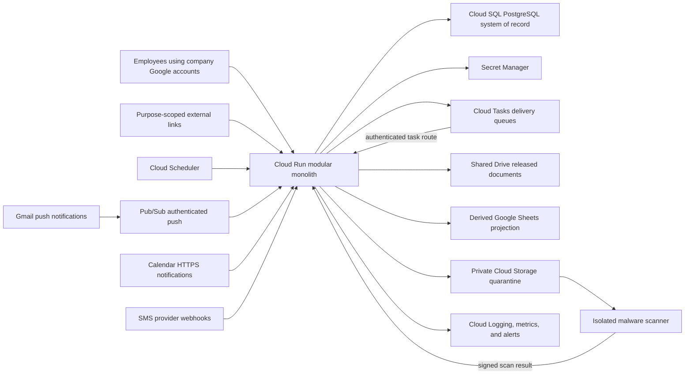

# Complete product and Google Cloud architecture audit

Audit date: July 13, 2026

Scope: FCI Operations for one company and approximately 20 employees

Production target: Google Cloud with Google Workspace-centered identity and collaboration

Status: Architecture baseline and ordered roadmap; owner decisions remain open

## Executive verdict

The accepted Google Cloud direction is appropriate. Keep one regional Cloud Run modular monolith with Cloud SQL PostgreSQL, Cloud Tasks, Cloud Scheduler, Secret Manager, Cloud Storage quarantine, Gmail Pub/Sub notifications, Calendar HTTPS webhooks, and Google Workspace OpenID Connect. Add a small isolated malware-scanner service only because file scanning has a different security and resource profile. Do not create a fleet of product microservices for a 20-person company.

The current Sites/Workers/D1/R2 application remains useful as a controlled, single-user development environment with test data. It is not yet a production Google Cloud application. The production PostgreSQL work covers only clients, contacts, projects, activity evidence, idempotency, an outbox, and migration history. It does not yet provide a Cloud Run runtime, employee identity, authorization, the full application schema, durable workers, secure files, migration rehearsal, or recovery proof.

Google Workspace access is not the next development blocker. Most of the foundation can be built with simulated identities, provider interfaces, fixtures, and local PostgreSQL. Live OAuth clients, company resources, watches, webhook channels, phone numbers, and production infrastructure should wait for the administrator and owner gates in this document.

The product is currently a CRM and Google-integration prototype rather than a complete flooring operations platform. The largest functional decisions still concern estimating and proposals, material procurement, project controls and change orders, workforce scheduling, field workflows, accounting boundaries, communications, closeout, and warranty.

## Evidence from the current repository

- The main interface is a 1,948-line client component with in-memory view switching rather than durable routes and feature modules.
- The development D1 model has 21 product and integration tables; the production PostgreSQL registry has only the first seven tables including migration history.
- Twenty-two application files are coupled to `cloudflare:workers`, and 20 access `env.DB` directly.
- There is no production Node/Cloud Run container, PostgreSQL runtime pool, migration job, health/readiness endpoint, infrastructure-as-code definition, or production configuration validator.
- The current allowlist and `isAdmin` flag are appropriate only behind the controlled development host. Durable users, invitations, sessions, roles, capabilities, and project memberships do not exist.
- The current production `activity_events` record requires a client or project. It cannot audit login failures, session revocation, role changes, connector administration, exports, files, jobs, or recovery actions.
- Uploads currently write directly to R2 without a durable file record or quarantine, scan, release, checksum, retention, and download-authorization lifecycle.
- Gmail suggestions are generated on demand; there is no durable watch/history processor or durable review queue. Calendar can create an unlinked test hold; it does not yet provide authoritative linked appointments or conflict reconciliation.
- A separate `codex/postgres-repositories` branch contains the proposed next PostgreSQL repository/idempotency/outbox slice. Review that work before reimplementing the same scope.

## Product boundary to approve

FCI Operations should be the operational system of record for clients, sites, leads, projects, tasks, appointments, project evidence, operational status, communication history, and Google resource mappings. Cloud SQL should be authoritative for those records.

Google Workspace should remain the company collaboration layer:

- Google identity authenticates employees, while the application decides whether each employee is invited and what they may do.
- Shared Drive owns released business documents; the application owns their metadata, permissions, lifecycle, and mapping.
- Gmail owns mail transport and the company mailbox; the application owns filing decisions, workflow state, and the permitted activity copy.
- Calendar displays appointments and published assignments; the application owns operational state, assignments, and conflict rules.
- Sheets is a derived directory/reporting projection, never a second operational database.

The owner must identify the authoritative products for estimating/takeoff, accounting and payments, payroll/timekeeping, and any franchise CRM. FCI Operations should integrate with those products rather than silently create an unreconciled second ledger. If one of those domains is deliberately assigned to this app, approve its rules and controls before implementation.

## Target production topology

### Important topology rules

- Keep the web/API/task/webhook application in one deployable service initially. Split a domain service only when isolation, scaling, or deployment evidence justifies it.
- Use a private Cloud SQL connection in the same region and cap `Cloud Run maximum instances × pool size` below the database connection budget.
- Cloud Run has no permanent background loop. Cloud Scheduler should trigger outbox sweeps, expired-lease recovery, long-horizon reminder materialization, Gmail watch renewal, Calendar channel renewal, reconciliation, and cleanup.
- Cloud Tasks provides controlled delivery and retries, but the application must own durable execution attempts, terminal failures, operator alerts, and safe replay.
- Public webhook and internal task endpoints require different validation even when they share one Cloud Run service.
- Use separate development, staging, and production Google Cloud projects, databases, secrets, buckets, queues, OAuth clients, and Workspace test resources.
- Decide before production whether the data model is permanently single-company/single-office or needs an `organization_id` and `office_id` boundary for credible future multi-office use.

## Trust boundaries and endpoint authentication

| Caller | Endpoint purpose | Required validation |
| --- | --- | --- |
| Employee browser | Product pages and API | Google OIDC token verified server-side; stable `sub`; signed `hd=cherryhillfci.com`; explicit invitation; active user and session; capability and project scope |
| Cloud Tasks | Durable job delivery | Google-signed OIDC token, exact audience, approved single-purpose service account, job ID, execution generation, idempotency, and lease/fencing check |
| Cloud Scheduler | Sweep and renewal trigger | Google-signed OIDC token, exact audience, approved service account, bounded batch behavior |
| Gmail Pub/Sub push | Mailbox-change hint | Authenticated Pub/Sub push identity and subscription/audience; deduplicated notification; durable history cursor |
| Calendar | Calendar-change hint | Stored channel ID, resource ID, channel token, expiration, and subsequent API reconciliation |
| SMS provider | Status or inbound message | Provider signature over the externally visible URL and body, timestamp/replay controls where supported, deduplication, and append-only provider event |
| Purpose-scoped external user | Proposal, appointment, upload, or approval | High-entropy hashed token, exact resource/action scope, short expiry, revocation, rate limit, and audited use |

## Complete functional capability map

| Domain | Current evidence | Required production capability | Priority |
| --- | --- | --- | --- |
| Intake and CRM | Basic lead creation and stage movement | Website/email/phone/referral intake, normalized deduplication, ownership, response SLA, consent, qualification, loss reasons, controlled pipeline | P1 |
| Clients, contacts, and sites | Client and optional primary contact | Multiple contacts and locations, billing/site roles, edit/archive/merge, duplicate-review workflow | P1 |
| Site survey | Not modeled | Rooms/areas, measurements, substrate and moisture readings, floor preparation, photos, installation constraints | P1 decision |
| Estimates and proposals | Estimated project value only | Product/specification, quantity/waste, labor/material/freight/tax/margin lines, immutable revisions, approval thresholds, send/accept evidence | P1 decision |
| Lead conversion | Lead status can change independently | One idempotent transaction that creates or reuses client/contact/project and preserves lead evidence | P1 |
| Project controls | Project create/list and manager correction | Scope, dates, phases, milestones, assignments, tasks, dependencies, notes, issues/RFIs, risk, change orders | P1 |
| Products and procurement | Not modeled | Vendors, products/SKUs/colors/lots, POs, acknowledgements, ETAs, backorders, receiving, damage/shortage, returns, material-readiness gate | P1 decision |
| Workforce and scheduling | Planned only | Employees/subcontractors/crews, skills, certifications/insurance, availability, shifts, conflicts, publish, acknowledge/decline | After P0 |
| Field operations | Not modeled | Mobile workflow, daily logs, installed quantities, readings, photos, safety/quality issues, customer signoff, explicit offline policy | After P0 |
| Communications | Gmail review/copy and draft reply | Unified permitted timeline, consent, templates, quiet hours, email/SMS delivery workflow, inbound replies, suppressions, exception handling | After P0 |
| Files | R2 upload and Gmail artifacts | Durable metadata, typed association, quarantine/scan/release, checksum/version, Drive mapping, retention/legal hold, permissioned download | P0 |
| Financial boundary | Estimated value only | Contract/deposit/invoice/payment/retainage/cost/margin summaries and external IDs, or an explicitly approved app-owned ledger | P1 decision |
| Closeout | Not modeled | Punch list, QA/final inspection, completion approval, care/warranty documents, required billing/document gates | P1 |
| Warranty/service | Not modeled | Installed product/lot evidence, coverage, claim triage, service visits, resolution, customer approval | P1 |
| Reporting | Current counts | Defined metrics, time and role scope, drilldown, funnel aging, win/loss, backlog, material risk, utilization, margin, closeout, warranty | Incremental |
| Administration | Basic settings | Reference data, invitations/users, templates, access review, retention, connector health, job exceptions, import/deduplication, audit viewer | P0/P1 |
| AI and document search | In-development assistant | Permission-filtered evidence, evaluation set, prompt/response safety, citation, retention; `pgvector` only when scheduled | P2 |

## Canonical state machines

Statuses must be controlled server-side. Every transition should validate the current version and capability, persist actor/time/reason/correlation ID, and create any related task or outbox event atomically.

| Aggregate | Minimum state flow |
| --- | --- |
| Lead | New → Contacted → Qualified → Site visit → Estimating → Proposal sent → Negotiating → Won or Lost/Disqualified |
| Estimate/proposal | Draft → Internal review → Approved → Sent → Accepted, Rejected, Expired, or Superseded |
| Project | Planning → Mobilizing → Installation → Closeout → Completed → Archived, with reasoned Cancelled branch |
| Task | Open → In progress or Blocked → Completed or Cancelled |
| Appointment | Proposed → Awaiting confirmation → Confirmed → Completed, Cancelled, No-show, or Expired |
| Material order | Draft → Approved → Ordered → Acknowledged → Partial/Backordered → Received, Cancelled, or Returned |
| Shift | Draft → Published → Acknowledged or Declined → In progress → Completed, Cancelled, or No-show |
| Message | Planned → Queued → Sending → Submitted → Delivered where provider evidence exists, Failed, Suppressed, Unknown, or Cancelled |
| File | Quarantined → Scanning → Approved or Rejected → Released → Archived or Deleted |
| Change order | Draft → Review → Sent → Accepted, Rejected, or Voided |
| Punch item | Open → Assigned → Ready for review → Closed or Waived |
| Warranty claim | Reported → Triaged → Scheduled → In progress → Resolved → Closed or Denied |

Do not label Gmail-submitted email as `delivered`; Gmail API submission is not a carrier-style delivery receipt. A timed-out SMS provider request may be `unknown` rather than safe to retry.

## Production data modules

Use one PostgreSQL database with explicit module ownership and foreign keys. This is a modular monolith, not one undifferentiated schema.

### P0 platform tables

- Identity: `users`, `external_identities`, `invitations`, `sessions`, `roles`, `capabilities`, `role_capabilities`, `user_roles`, `project_memberships`.
- Security evidence: general append-only `audit_events`, separate from user-facing `activity_events`.
- Durable work: `outbox_events`, `jobs`, `job_attempts`, `webhook_receipts`, `failed_jobs`, optional `job_dependencies`.
- Integrations: encrypted `google_connections`, `integration_resources`, `integration_cursors`, `notification_channels`, `integration_events`.
- Files: `files`, `file_versions`, `storage_objects`, `file_scans`, `file_links`, `retention_holds`.
- Operations: `feature_flags`, `system_settings`, `integration_health`, and migration history.

### P1 business tables

- CRM: clients/accounts, contacts, sites, leads, lead assignments, lead transitions, duplicate candidates.
- Estimating: surveys, areas, measurements, products, estimate revisions, estimate lines, approvals, proposal deliveries/acceptances.
- Projects: projects, phases, milestones, assignments, tasks, dependencies, notes, issues/RFIs, change orders.
- Procurement: vendors, purchase orders and lines, acknowledgements, shipments, receipts, returns, material-readiness evidence.
- Workforce: workers, subcontractors, crews, skills/certifications, availability, shifts, assignments, acknowledgements.
- Communications: consents, preferences, templates and versions, reminders, outbound messages, message attempts/events, inbound messages, suppressions.
- Closeout: punch items, inspections, approvals, closeout packages, warranties, warranty claims and visits.
- Finance boundary: operational contract/billing/cost summaries plus immutable external-accounting identifiers unless the app is explicitly approved to own a ledger.

All foreign keys need supporting indexes. Runtime and migration database roles should be separate and least-privileged. Add check/unique constraints for invariants, short network-free transactions, `FOR UPDATE SKIP LOCKED` for bounded worker claims, and keyset pagination for growing timelines and work queues.

## Identity and authorization architecture

Employee login and the one company Google data connector are separate OAuth clients and grants.

1. Verify Google ID-token signature, issuer, audience, expiration, and the signed hosted-domain claim on the server.
2. Store Google `sub` as the stable external identity; do not use mutable email as the key.
3. Require an unexpired invitation and active application user even when the OAuth audience is Internal. Internal audience alone does not limit the app to the intended 20 employees.
4. Issue secure server sessions with rotation, inactivity/absolute expiry, revocation, CSRF/same-origin defenses, and no provider token in the browser.
5. Resolve capabilities and project scope into an access context used inside repository queries. A hidden button is never authorization.
6. Recheck disabled status and critical permission changes promptly; audit login, logout, failure, invitation, session revocation, role/capability, membership, export, and administrative actions.
7. Start with Admin, Office Operations, and Project Manager; decide whether Sales/Estimator and Field Lead need separate roles.
8. Prefer purpose-scoped expiring links for subcontractors or clients unless the owner approves full accounts.

## Durable work, reminders, and texting

### General work contract

1. A short business transaction changes the aggregate, adds the appropriate business activity and security-audit evidence, and inserts an outbox event.
2. A Scheduler-triggered dispatcher claims a small outbox batch with fencing, commits the claim, then creates Cloud Tasks outside the transaction.
3. The authenticated task handler checks job generation and idempotency, records an attempt, performs a bounded provider call, and records the result.
4. Retryable and terminal errors are classified explicitly. Terminal/exhausted work remains in an application-owned failed-job record with alerting and controlled replay/cancel tools.
5. Provider webhooks append deduplicated events. Older callbacks cannot overwrite a newer terminal state.

### Reminder planning

Cloud Tasks is not a long-term reminder database. Its current scheduling window is approximately 30 days and task retention is limited. Store every future reminder canonically in PostgreSQL. A daily Scheduler job should materialize only reminders inside the next safe delivery window. Immediately before delivery, recheck that the reminder generation, recipient, phone/email, project state, authorization, consent, suppression, quiet hours, and timezone are still current.

### Texting data and behavior

- Normalize phone numbers to E.164 and preserve source/evidence.
- Keep consent by recipient, channel, purpose, source, terms version, and effective time. Marketing consent must remain distinct from operational appointment/project notices.
- Store a versioned template snapshot on each outbound message so later template edits do not rewrite history.
- Maintain local suppressions and support STOP/START/HELP handling even when the provider also offers opt-out tooling.
- Store provider message IDs uniquely and append status callbacks rather than overwriting evidence.
- Treat timeouts after possible transmission as `unknown` and send them to a human exception queue; blind retry can duplicate a text.
- Define quiet hours and recipient timezone fallback, maximum attempts, per-contact frequency limits, escalation, cost caps, inbound routing, retention, and who may send or approve each class of message.
- Use a fake provider and signed-webhook fixtures first. Do not acquire a production number or send a live message until the owner approves consent language, operational versus marketing use, sender type, templates, hours, and escalation.

For a US sender, the owner will need to choose an approved messaging route such as registered A2P 10DLC or a verified toll-free sender and follow the provider's consent and opt-out rules. Obtain legal/compliance review appropriate to the company's use; architecture documentation is not legal advice.

## Google integration reliability

### Gmail

- Persist mailbox, watch expiration, latest history ID, last successful reconciliation, and connection health.
- Renew the watch daily; Google requires renewal at least every seven days.
- Treat Pub/Sub notifications as hints, process `history.list` serially per mailbox, deduplicate changes, and run periodic reconciliation because notifications can be delayed or dropped.
- Perform a bounded full resynchronization when the history cursor is no longer valid.
- Keep review-first filing; do not auto-send or silently file messages.

### Calendar

- Persist calendar ID, channel ID, resource ID, channel token, channel expiration, sync token, and reconciliation state.
- Renew expiring channels with overlap, validate each notification, then fetch authoritative changes. Calendar notifications do not contain the changed event body.
- Handle invalid sync tokens with a bounded full resynchronization and periodically reconcile because notifications are not guaranteed.
- Use one authority for configured calendar IDs; remove the saved-settings versus environment-value conflict.
- Model recurring instances, cancellations, timezones, all-day events, organizer/attendee rules, and app event identity before scheduling is accepted.

### Drive and Sheets

- Store immutable Shared Drive/file/folder IDs and use Shared Drive-aware request parameters.
- Provision folders through idempotent queued operations and reconcile missing/moved resources.
- Send every untrusted file through the quarantine lifecycle before release to Shared Drive.
- Update the Sheet as record-level queued deltas with immutable IDs, schema version, single-flight/ordering controls, and reconciliation. Do not clear and rewrite the entire register in a user request.

### OAuth token custody

- Store refresh tokens encrypted with named key versions in Secret Manager-backed configuration.
- Support decrypting old key versions during rotation and explicitly re-encrypt to a new version.
- Use single-flight token refresh and distinguish transient provider failure from revoked authorization.
- Add request deadlines, bounded retry/backoff, correlation IDs, quota handling, redaction, and metrics to every Google client.
- Do not use domain-wide delegation when interactive OAuth for one approved operations account satisfies the requirement.

## Files and document safety

1. Create a durable file row and authorized upload intent before accepting bytes.
2. Stream to a private quarantine bucket with public-access prevention; enforce request and object-size limits.
3. Record checksum, detected type, uploader, association, retention class, and object generation.
4. Trigger the isolated scanner from object finalization. Scan result updates must be idempotent and generation-specific.
5. Copy only approved content to a released bucket or Shared Drive and retain the immutable mapping.
6. Authorize downloads using current project/file permissions, not possession of an object key.
7. Audit upload, scan, release, download/share, hold, archive, and deletion.
8. Define attachment policy, failed-scan review, retention, legal hold, backup scope, and deletion propagation before real client files.

## Frontend and API architecture

- Replace in-memory page switching with App Router URLs so pages are refreshable, linkable, permission-testable, and independently loadable.
- Split the large client component into route shells and feature modules. Load heavy assistant/report panels only when needed.
- Start independent reads on the server in parallel, pass only minimal serialized data to clients, and use one query-cache strategy for deduplication, freshness, focus/reconnect refetch, and mutations.
- Define runtime request/response schemas and a consistent typed error envelope with correlation ID.
- Add optimistic concurrency using a version/ETag and a clear `409 Conflict` recovery UI.
- Use keyset pagination for activity, messages, jobs, search, and audit history.
- Centralize request context, security headers, request limits, authentication/sensitive-route rate limits, cache rules, structured logging, and redaction.
- Remove or tightly type the generic records endpoint; it must not bypass domain invariants. Unassigned uploads must not remain a production escape hatch.
- Keep accessibility and representative desktop/mobile browser tests as release gates.

## Operations, observability, and recovery

- Add liveness, database readiness, migration-version readiness, and connector health endpoints with no secret leakage.
- Use structured logs with correlation, actor, aggregate, job, and provider request IDs; never log tokens, secrets, sensitive message bodies, or raw client documents.
- Monitor error rate, latency, Cloud SQL connections/storage/CPU, outbox age, oldest ready job, failed jobs, provider exceptions, watch/channel expiration, sync lag, scan backlog, and budget thresholds.
- Budget alerts notify; they do not automatically cap spend. Add application/provider quotas and a small initial Cloud Run maximum-instance limit.
- Define RPO/RTO, availability target, maintenance window, HA choice, retention, regional failure policy, and two trained recovery administrators.
- Enable backups and point-in-time recovery, but do not call recovery complete until a separate environment restore, integrity reconciliation, and application smoke test pass.
- Use keyless CI-to-Google authentication, a separate migration job/identity, least-privilege runtime identity, protected production approvals, and a documented rollback owner.
- Maintain runbooks for bad deployment, database saturation, Google reauthorization, missed Gmail/Calendar events, job backlog, duplicate/unknown SMS, failed scan, security incident, and restore.

## Work that can continue before Workspace is connected

The following work is safe when it changes source, local fixtures, and tests only:

1. Review and finish the PostgreSQL repository, actor-scoped idempotency, atomic activity/outbox, and outbox-claim branch.
2. Add the full identity, invitation, secure-session, role/capability, project-membership, and general security-audit schema.
3. Implement a simulated authorization policy and negative cross-project tests across list, search, dashboard, files, Gmail evidence, meetings, and assistant evidence.
4. Add the standard Node/Cloud Run runtime kernel, validated configuration, capped PostgreSQL pool, migration command/job, and health endpoints without provisioning Google Cloud.
5. Define durable job/attempt/failed-job and future Scheduler/reminder-materialization schemas, contracts, state machines, fakes, and tests. Do not add an operational Scheduler, reminder planner, or delivery handler before the production platform and authorization foundation are accepted.
6. Model and test Gmail watch/history and Calendar channel/sync-token state machines entirely with fixtures.
7. Add file metadata, quarantine lifecycle, scanner/storage ports, release rules, and permission tests using local fakes.
8. Build core edit/archive, atomic lead conversion, project dates, tasks/follow-ups, notes, concurrency, and activity behavior.
9. Split the frontend into durable routes/features and add typed failure, freshness, conflict, accessibility, and responsive behavior.
10. Write ADRs, domain schemas, state-transition tests, and provider-neutral contracts for estimating, procurement, scheduling, field operations, messaging, closeout, and warranty.
11. Add transformation, duplicate-review, count/hash reconciliation, backup/restore, cutover, and rollback fixtures using test data only.

Design/contracts/fixtures for scheduling and communications may proceed, but operational scheduling or live messaging remains behind the production platform and authorization acceptance gates.

## Work that still requires an owner or administrator

- Create company-owned development, staging, and production Google Cloud projects, billing, region, IAM, budgets, DNS, and live resources.
- Create separate Internal employee-login and company-data-connector OAuth clients, exact redirect URIs, API Controls trust, and production secrets.
- Provision the operations mailbox, Shared Drive, directory Sheet, calendars, groups, and access rules.
- Run final `cherryhillfci.com` OIDC, Gmail, Calendar, Drive, and Sheets acceptance with company accounts and test records.
- Approve the operational source-of-truth boundaries, roles, data retention, recovery targets, field access, and messaging policy.
- Select and register the SMS sender/provider, approve consent/opt-out language and templates, and authorize the first live test.
- Approve staging migration rehearsal, production cutover, deployment, second-user access, and any real client data.

## Ordered branch-sized implementation roadmap

| Order | Suggested branch | Bounded outcome | Gate |
| --- | --- | --- | --- |
| 1 | `codex/postgres-repositories` | PostgreSQL client/project adapters, atomic idempotency, activity/outbox transaction, bounded outbox claims | Review existing branch first |
| 2 | `codex/identity-audit-schema` | Users, identities, invitations, sessions, roles/capabilities, memberships, general security audit | Owner approves role direction |
| 3 | `codex/authorization-simulation` | Access-context policy, repository scoping, simulated principals, denial tests | Identity schema accepted |
| 4 | `codex/cloud-run-runtime-kernel` | Node container/build, config validation, PostgreSQL pool, migration job command, health endpoints | No live provisioning |
| 5 | `codex/jobs-scheduler-contracts` | Provider-neutral job/attempt/failure, outbox-relay, future Scheduler/reminder, task-fixture, and replay contracts/tests only | Platform and authorization gates before operational delivery |
| 6 | `codex/google-sync-state-machines` | Gmail and Calendar durable cursors/renewal/reconciliation with fixtures | No live watches/channels |
| 7 | `codex/file-quarantine-contracts` | File metadata, quarantine/scan/release ports and permission tests | File policy approved |
| 8 | `codex/http-observability` | Request context, typed errors, headers/limits, structured logs, health metrics | Redaction policy approved |
| 9 | `codex/core-record-concurrency` | Edit/archive, atomic conversion, dates/tasks/notes, version conflicts | Authorization enforced |
| 10 | `codex/frontend-routes-features` | Durable routes, feature split, query/failure/conflict behavior | Core API contracts stable |
| 11 | `codex/migration-rehearsal` | Test-data transform, duplicate report, reconciliation, restore/cutover evidence | Staging resources later |
| 12 | Domain branches | Estimate, procurement, schedule/field, messaging, closeout/warranty slices | Each owner decision approved |

Do not deploy or provision during these source-only branches. Keep each pull request independently reviewable and include data/security impact plus tests.

## Owner decisions that prevent architectural rework

- Is the first release permanently one company/one office, or must the model support multiple offices or franchise entities later?
- Which existing franchise CRM, estimating/takeoff, accounting/payment, payroll/timekeeping, or scheduling systems must integrate with this app?
- Which exact lead stages, loss reasons, response SLAs, stale-lead rules, and conversion requirements apply?
- Will estimates and proposals be created here, and who may see cost/margin or approve discounts/change orders?
- Which accounting system owns invoices, payments, tax, retainage, commissions, and financial reconciliation?
- Are field workers employees, subcontractors, or both, and which insurance, certification, time, and compliance records are required?
- Is true offline field work required for the first release, or is online-only with an explicit degraded/offline state acceptable?
- Which staff receive Admin, Office Operations, Project Manager, Sales/Estimator, or Field Lead capabilities?
- Which external client/subcontractor actions need expiring links or a portal?
- Which appointment, project, employee, and marketing messages may be automated, from which sender, during which hours, with which human approval and escalation?
- What are retention/deletion rules for mail copies, texts, call notes, photos, files, audit records, and backups?
- What region, hostname, budget, availability, RPO/RTO, deployment approver, rollback owner, and incident contacts are approved?

## Acceptance gates

### Gate A: source-only production foundation

- PostgreSQL schema and repositories cover every production-owned record or have an explicit migration/exclusion mapping.
- Idempotency, optimistic concurrency, outbox/jobs/failures, files, identity, authorization, and security audit have automated behavior and negative tests.
- Cloud Run runtime and infrastructure definitions are reproducible but have not been applied without approval.

### Gate B: staging and recovery

- A clean staging environment is reproducibly provisioned with least-privilege identities and non-production resources.
- Test-data migration preserves identifiers, reports duplicates, and reconciles counts/hashes.
- Backup restoration, point-in-time recovery, forward-fix/rollback, alerts, and runbooks pass with recorded evidence.

### Gate C: Google and communication integrations

- Employee OIDC and invitation enforcement pass with company accounts.
- Gmail history/watch and Calendar channel/sync recovery pass normal, duplicate, delayed, dropped, expired, and full-resync cases.
- Drive/Sheets reconciliation and file quarantine/release pass.
- Messaging consent, quiet hours, STOP/START, signed callbacks, unknown outcome, retries, suppression, and replay controls pass before the first live recipient.

### Gate D: second user and real data

- Approved roles and project permissions pass positive and negative representative-user tests.
- Session revocation, user disablement, audit access, exports, retention, and file downloads are enforced server-side.
- Restore and incident owners are trained, and the owner explicitly approves production cutover and real data.

## Official implementation references

- [Cloud Run to Cloud SQL](https://docs.cloud.google.com/sql/docs/postgres/connect-run)
- [Cloud SQL connection management](https://docs.cloud.google.com/sql/docs/postgres/manage-connections)
- [Cloud Tasks overview](https://docs.cloud.google.com/tasks/docs/dual-overview)
- [Cloud Tasks quotas](https://docs.cloud.google.com/tasks/docs/quotas)
- [Cloud Scheduler to Cloud Run](https://docs.cloud.google.com/run/docs/triggering/using-scheduler)
- [Authenticated Pub/Sub push](https://docs.cloud.google.com/pubsub/docs/authenticate-push-subscriptions)
- [Gmail push notifications](https://developers.google.com/workspace/gmail/api/guides/push)
- [Gmail history synchronization](https://developers.google.com/workspace/gmail/api/reference/rest/v1/users.history/list)
- [Calendar push notifications](https://developers.google.com/workspace/calendar/api/guides/push)
- [Calendar incremental synchronization](https://developers.google.com/workspace/calendar/api/guides/sync)
- [Google OpenID Connect](https://developers.google.com/identity/openid-connect/openid-connect)
- [Service account practices](https://docs.cloud.google.com/iam/docs/best-practices-service-accounts)
- [Secret Manager practices](https://docs.cloud.google.com/secret-manager/docs/best-practices)
- [Cloud SQL point-in-time recovery](https://docs.cloud.google.com/sql/docs/postgres/backup-recovery/configure-pitr)
- [Cloud Storage malware-scanning pattern](https://docs.cloud.google.com/architecture/automate-malware-scanning-for-documents-uploaded-to-cloud-storage/deployment)
- [Twilio messaging policy](https://www.twilio.com/en-us/legal/messaging-policy)
- [Twilio opt-out handling](https://www.twilio.com/docs/messaging/tutorials/advanced-opt-out)
- [Twilio status callbacks](https://www.twilio.com/docs/messaging/guides/track-outbound-message-status)
- [Twilio webhook validation](https://www.twilio.com/docs/usage/webhooks/webhooks-security)
